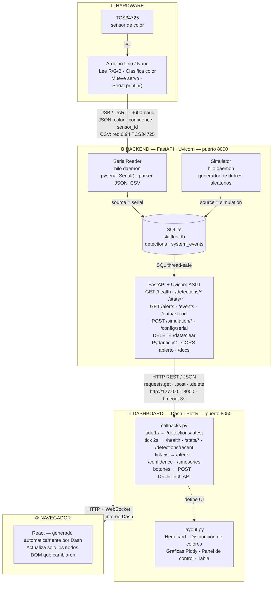
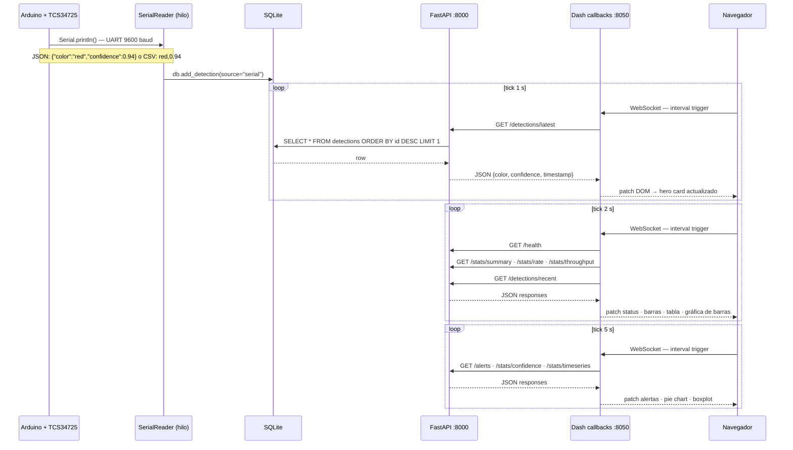
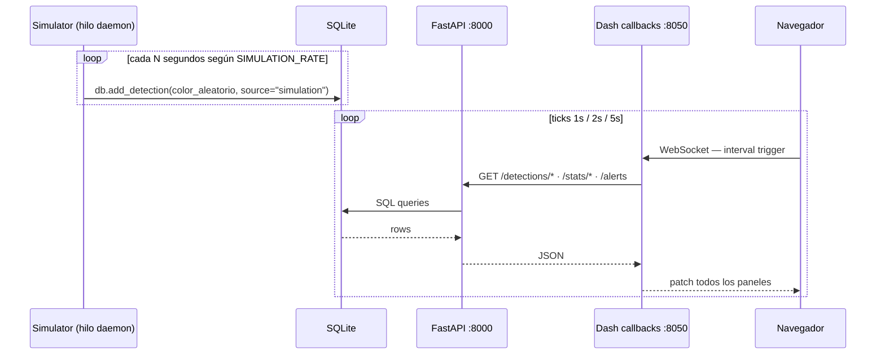
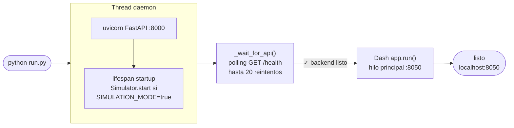

# Smart Skittles Color Sorting System

> Dashboard en tiempo real para una máquina clasificadora de Skittles impresa en 3D, desarrollada en Python con FastAPI, Dash y SQLite.

**Equipo:** Kamila G · Alicia G · Roy R · Carlos I · Jorge R

---

## Cómo se construyó la plataforma

### Stack tecnológico

| Capa | Tecnología | Por qué |
|------|-----------|---------|
| Lenguaje base | **Python 3.10+** | único lenguaje para todo el sistema |
| Backend / API | **FastAPI 0.110** | async, tipado con Pydantic v2, autodocs en `/docs` |
| Servidor ASGI | **Uvicorn** | sirve FastAPI en el puerto 8000 |
| Frontend / UI | **Dash 2.16 + Plotly 5** | genera React automáticamente desde Python, sin JS |
| Base de datos | **SQLite** (built-in Python) | archivo local `data/skittles.db`, sin servidor |
| Puerto serial | **PySerial 3.5** | lee UART del Arduino desde un hilo daemon |
| Validación | **Pydantic v2** | esquemas de request/response en el backend |
| Comunicación intra-proceso | **requests** | el servidor Dash llama a FastAPI por HTTP local |
| Estilo | **CSS personalizado** | tema oscuro estilo IoT industrial |

### Protocolos de comunicación

| Enlace | Protocolo | Formato |
|--------|-----------|---------|
| Arduino → Backend | **UART / USB Serial** (9 600 baud) | JSON `{"color":"red","confidence":0.94}` o CSV `red,0.94` |
| Backend → BD | **SQLite** (archivo, sin red) | SQL directo |
| Backend ↔ Dashboard | **HTTP REST** en `127.0.0.1:8000` | JSON |
| Dashboard ↔ Navegador | **HTTP + WebSocket** (protocolo interno de Dash) | JSON de callbacks |

---

## Arquitectura de alto nivel



### Flujo de datos — modo serial



### Flujo de datos — modo simulación



### Secuencia de arranque (`run.py`)



---

## Inicio rápido

### 1. Requisitos previos

- Python 3.10 o superior
- (Opcional) Arduino con sensor TCS34725

### 2. Instalar dependencias

```bash
cd color_sorter_dashboard
pip install -r requirements.txt
```

### 3. Configurar (opcional)

```bash
cp .env.example .env
# Editar .env para ajustar SERIAL_PORT, BAUD_RATE, SIMULATION_RATE, etc.
```

### 4. Ejecutar el sistema

```bash
# Desde el directorio color_sorter_dashboard/
python run.py
```

El dashboard se abre en **http://localhost:8050**  
La documentación de la API está en **http://localhost:8000/docs**

> **El modo simulación está activo por defecto.** Los dulces se generan automáticamente — no se requiere hardware.

### 5. Opciones de línea de comandos

```
python run.py --rate 3.0         # simulación a 3 dulces/s
python run.py --no-sim           # desactivar simulación (usar hardware)
python run.py --port COM4        # puerto serial predeterminado
python run.py --api-port 8001 --dash-port 8051   # puertos personalizados
```

---

## Ejecutar componentes por separado

```bash
# Terminal 1 — solo backend
uvicorn backend.main:app --reload --port 8000

# Terminal 2 — solo dashboard (el backend debe estar corriendo)
python -c "from dashboard.app import create_app; create_app().run(port=8050)"
```

---

## Simular datos seriales

```bash
# Modo API — inyecta detecciones directamente (sin puerto COM)
python scripts/simulate_serial.py --rate 2

# Modo serial — escribe en un puerto COM real o virtual
python scripts/simulate_serial.py --port COM5 --baud 9600 --rate 1
```

**Puertos COM virtuales:**
- **Windows:** Instalar [com0com](https://sourceforge.net/projects/com0com/), crear un par (ej. COM4↔COM5). Apuntar `simulate_serial.py` a COM5 y la app a COM4.
- **Linux/macOS:** `socat -d -d pty,raw,echo=0 pty,raw,echo=0` (muestra dos rutas `/dev/pts/N`).

---

## Formato de datos seriales

**JSON (recomendado):**
```json
{"color":"red","confidence":0.94,"sensor_id":"TCS34725","timestamp":"2026-04-23T12:00:00"}
```

**CSV (también aceptado):**
```
red,0.94,TCS34725
```

**Colores soportados:** `red` · `orange` · `yellow` · `green` · `blue` · `purple` · `unknown`

---

## Referencia de la API REST

| Método | Endpoint | Descripción |
|--------|----------|-------------|
| GET | `/health` | Estado del sistema, modo, tiempo activo |
| GET | `/detections/latest` | Detección más reciente |
| GET | `/detections/recent?limit=50` | Últimas N detecciones |
| POST | `/detections/add` | Inyectar una detección manualmente |
| GET | `/stats/summary` | Conteos y porcentajes por color |
| GET | `/stats/rate?minutes=5` | Métricas de rendimiento |
| GET | `/stats/timeseries?hours=1` | Detecciones ordenadas por tiempo |
| GET | `/stats/throughput?minutes=15` | Rendimiento por minuto |
| GET | `/stats/confidence` | Valores de confianza por color |
| GET | `/alerts` | Alertas activas del sistema |
| POST | `/simulation/start` | `{"rate": 1.5}` |
| POST | `/simulation/stop` | Detener simulación |
| POST | `/config/serial` | `{"port":"COM3","baud_rate":9600}` |
| DELETE | `/data/clear` | Borrar todas las detecciones |
| GET | `/data/export` | Descargar CSV |
| GET | `/events` | Registro de eventos del sistema |

Documentación interactiva: **http://localhost:8000/docs**

---

## Esquema de la base de datos

**Tabla `detections`**

| Columna | Tipo | Descripción |
|---------|------|-------------|
| id | INTEGER PK | Autoincremental |
| timestamp | TEXT | ISO-8601 UTC |
| color | TEXT | Color clasificado |
| confidence | REAL | 0.0 – 1.0 |
| sensor_id | TEXT | Ej. `TCS34725` |
| raw_payload | TEXT | JSON/CSV original recibido |
| source | TEXT | `serial` / `simulation` / `external` |

**Tabla `system_events`**

| Columna | Tipo | Descripción |
|---------|------|-------------|
| id | INTEGER PK | Autoincremental |
| timestamp | TEXT | ISO-8601 UTC |
| event_type | TEXT | `serial_connect`, `simulation_start`, … |
| message | TEXT | Descripción en lenguaje natural |
| severity | TEXT | `info` / `warning` / `critical` |

---

## Paneles del dashboard

| Panel | Actualización |
|-------|---------------|
| Tarjeta principal (detección actual) | 1 s |
| Estado del sistema · Métricas de rendimiento | 2 s |
| Barras de distribución · Gráfica de barras | 2 s |
| Tendencia de rendimiento · Tabla de eventos | 2 s |
| Gráfica de pastel · Línea de tiempo · Caja de confianza | 5 s |
| Alertas inteligentes | 5 s |

---

## Condiciones de alerta

| Alerta | Severidad |
|--------|-----------|
| Sin detección por más de 10 s | Advertencia |
| Sin detección por más de 30 s | Crítica |
| Tasa de "unknown" > 10 % | Advertencia |
| Tasa de "unknown" > 25 % | Crítica |
| Confianza promedio < 70 % | Advertencia |
| Confianza promedio < 50 % | Crítica |
| Conteo de un color 8 % por debajo del promedio | Info |
| Rendimiento < 0.15 dulces/s | Advertencia |

---

## Estructura del proyecto

```
color_sorter_dashboard/
├── backend/
│   ├── __init__.py
│   ├── config.py          — configuración / carga de .env
│   ├── database.py        — gestor SQLite (singleton, thread-safe)
│   ├── models.py          — esquemas Pydantic v2
│   ├── serial_reader.py   — lector PySerial en hilo (parser JSON+CSV)
│   ├── simulator.py       — generador de dulces en background
│   ├── alerts.py          — motor de alertas
│   └── main.py            — aplicación FastAPI
├── dashboard/
│   ├── __init__.py
│   ├── app.py             — fábrica Dash
│   ├── layout.py          — layout completo de la interfaz
│   ├── callbacks.py       — todos los callbacks en tiempo real
│   └── assets/
│       └── custom.css     — tema oscuro estilo IoT industrial
├── data/
│   └── skittles.db        — creado automáticamente al ejecutar
├── scripts/
│   ├── simulate_serial.py — simulador CLI por API o puerto COM
│   └── arduino_example.ino— firmware Arduino con TCS34725 y servo
├── requirements.txt
├── .env.example
└── run.py                 — punto de entrada único
```

---

## Configuración con Arduino

1. Instalar librerías: **Adafruit_TCS34725**, **ArduinoJson** (v6), **Servo**
2. Abrir `scripts/arduino_example.ino` en el IDE de Arduino
3. Ajustar las posiciones del servo (`POS_RED`, `POS_ORANGE`, …) según la estructura física
4. Cargar el programa al microcontrolador
5. En `.env` establecer `SIMULATION_MODE=false` y `SERIAL_PORT=COMx`
6. Ejecutar `python run.py --no-sim`

---

## Solución de problemas

| Síntoma | Solución |
|---------|----------|
| Dashboard en blanco / sin datos | Verificar http://localhost:8000/health — el backend debe estar activo |
| `Address already in use` | Otro proceso usa el puerto 8000 u 8050 — usar `--api-port` / `--dash-port` |
| Puerto serial no encontrado | Revisar el Administrador de dispositivos (Windows) o `ls /dev/tty*` (Linux/Mac) |
| Alta tasa de "unknown" | Recalibrar umbrales de color en `arduino_example.ino` |
| Rendimiento bajo | Reducir `SIMULATION_RATE` o aumentar los intervalos `tick-*` en `layout.py` |

---

*Desarrollado con FastAPI · Dash · Plotly · SQLite · PySerial*
